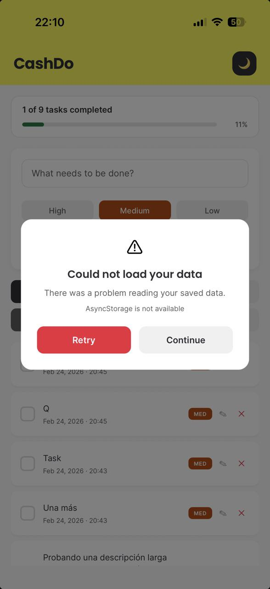

# CashDo

A TODO list app built with React Native, Expo, and TypeScript. Inspired by the look and feel of the Cashea parent app.

## Features

- Color palette, accents, favicon, and background aligned with Cashea branding
- Priority levels (High, Medium, Low) with color-coded badges
- Filter tasks by status (All, Completed, Pending) and priority
- Character counter appears at 80% of the 1000-character limit
- Clear input button after 10 characters
- Undo recently deleted tasks
- Task progress bar with completion tracking
- Data persistence across sessions (AsyncStorage)
- REST API integration with optimistic updates and offline merge strategy
- Smooth animations for task entry, exit, and completion
- Light and dark theme support
- WCAG AA contrast compliance across both themes
- Auto-scroll to the task being edited when the keyboard opens
- Pull-to-refresh to sync with the API
- Mobile-first design

## Getting Started

### Prerequisites

- Node.js 22+
- npm 10+
- Android: Android Studio (for emulator) or Expo Go on a physical device
- iOS: macOS with Xcode (for simulator) or Expo Go on a physical device
- Web: any modern browser (no additional setup needed)

### Installation

```bash
git clone https://github.com/cardacci/CashDo.git
cd CashDo
npm install
```

### Running the App

The app has two independent processes: the Expo dev server and the json-server mock API. Run both simultaneously in separate terminals for full API integration.

**Terminal 1: Mock API:**

```bash
npm run api        # Start json-server on http://localhost:3001
```

**Terminal 2: Expo:**

```bash
npm start          # Start Expo dev server
npm run android    # Run on Android emulator/device
npm run ios        # Run on iOS simulator/device
npm run web        # Run in the browser
```

> The app works without the API running, it falls back to locally cached data (AsyncStorage). A "Sync failed" modal will appear on startup and can be dismissed.

Or try it live at [https://cardacci.github.io/CashDo](https://cardacci.github.io/CashDo)

## Dependencies

| Package                                   | Version  | Purpose               |
| ----------------------------------------- | -------- | --------------------- |
| expo                                      | ~54.0.33 | Development framework |
| react                                     | 19.1.0   | UI library            |
| react-native                              | 0.81.5   | Mobile runtime        |
| zustand                                   | ^5.0.11  | State management      |
| @react-native-async-storage/async-storage | 2.2.0    | Local cache           |
| react-native-web                          | ^0.21.0  | Web support           |
| typescript                                | ~5.9.2   | Type safety           |
| json-server _(dev)_                       | ^1.0.0   | Mock REST API         |

## API Integration

The app integrates a REST API layer (json-server) alongside AsyncStorage, following an **optimistic update** strategy:

```
User Action → Zustand Store (instant local update)
				  ├── AsyncStorage  (automatic via persist middleware)
				  └── API call      (async, fire-and-forget)
```

- **App start:** AsyncStorage is hydrated first for a fast initial render, then the API is fetched. Tasks created or edited while offline are pushed to the API, and the final state is merged using `updatedAt` timestamps.
- **Mutations** (create, edit, delete, toggle): the local store updates immediately for a responsive UI, and the API call fires in the background.
- **Pull-to-refresh:** applies the same offline-merge strategy as app start.
- **Offline mode:** if the API is unreachable, the app continues working from the AsyncStorage cache. A non-blocking error modal informs the user.

### Android emulator note

Android emulators route `localhost` to the emulator itself, not the host machine. The app automatically uses `http://10.0.2.2:3001` on Android and `http://localhost:3001` on iOS/web.

For **physical devices**, update `API.BASE_URL` in [src/constants/index.ts](src/constants/index.ts) to your machine's local IP address (e.g. `http://192.168.1.x:3001`).

## State Management

**Zustand** was chosen over Context API and Redux for the following reasons:

- **Minimal boilerplate:** No reducers, action creators, or providers wrapping the component tree. State is defined and consumed in a single, readable store.
- **Built-in persistence:** The `persist` middleware integrates directly with AsyncStorage, handling serialization, hydration, and error recovery out of the box.
- **Selective re-rendering:** Components subscribe only to the specific slices of state they need, avoiding unnecessary re-renders without extra memoization.
- **TypeScript-first:** Full type inference with no extra configuration.
- **Scalable simplicity:** The project uses three focused stores (`useTaskStore` for tasks, `useUndoStore` for undo functionality, and `useErrorStore` for centralized error handling), keeping each store small and testable.

## Error Handling

All errors are handled gracefully through a dedicated modal. The user is always notified with a clear message and actionable options.

| Scenario            | Modal                                                                                             |
| ------------------- | ------------------------------------------------------------------------------------------------- |
| Data failed to load |  |

- **Rehydration errors** (AsyncStorage read failed): the modal offers a **Retry** button to attempt rehydration again, and a **Continue** button to start with a fresh state.
- **Write errors** (AsyncStorage write failed): the modal shows a **Dismiss** button. The next state change will automatically retry the write.
- **API sync errors** (server unreachable or request failed): a friendly "Working offline" modal with a branded **Got it** button reassures the user that their data is saved locally and will sync automatically.

## Accessibility

WCAG 2.1 AA compliant: semantic roles, labels, live regions, focus trapping, 44px touch targets, and AA contrast ratios across both themes. Compatible with TalkBack, VoiceOver, and web ARIA.

## Performance (Lighthouse)

Audited against the production build on [GitHub Pages](https://cardacci.github.io/CashDo) (February 2026).

<table>
	<thead>
		<tr>
			<th align="left">Metric</th>
			<th align="center">Mobile</th>
			<th align="center">Desktop</th>
		</tr>
	</thead>
	<tbody>
		<tr>
			<td><strong>Performance</strong></td>
			<td align="center">71</td>
			<td align="center">92</td>
		</tr>
		<tr>
			<td style="vertical-align: middle;">FCP <sup><sub>First Contentful Paint</sub></sup></td>
			<td align="center" style="vertical-align: middle;">0.9 s</td>
			<td align="center" style="vertical-align: middle;">0.4 s</td>
		</tr>
		<tr>
			<td style="vertical-align: middle;">LCP <sup><sub>Largest Contentful Paint</sub></sup></td>
			<td align="center" style="vertical-align: middle;">6.1 s</td>
			<td align="center" style="vertical-align: middle;">1.2 s</td>
		</tr>
		<tr>
			<td style="vertical-align: middle;">TBT <sup><sub>Total Blocking Time</sub></sup></td>
			<td align="center" style="vertical-align: middle;">120 ms</td>
			<td align="center" style="vertical-align: middle;">0 ms</td>
		</tr>
		<tr>
			<td style="vertical-align: middle;">CLS <sup><sub>Cumulative Layout Shift</sub></sup></td>
			<td align="center" style="vertical-align: middle;">0.01</td>
			<td align="center" style="vertical-align: middle;">0.006</td>
		</tr>
		<tr>
			<td>Speed Index</td>
			<td align="center">6.6 s</td>
			<td align="center">2.4 s</td>
		</tr>
	</tbody>
</table>

**Note:** The mobile LCP (6.1 s) is impacted by the single JS bundle that Expo generates for the web build. Code splitting and lazy loading are potential optimizations for a future iteration.

## Assumptions & Trade-offs

- **Mock API:** json-server is used as the backend. It is a development tool and not suitable for production. All data lives in `db.json` on the local machine.
- **Task text limit:** 1000 characters per task, with a visual warning at 80% capacity.
- **Sort order:** Tasks are sorted by creation date (newest first). A configurable sort was not added to keep the UI focused.
- **Filters are not persisted:** Status and priority filters reset when the app restarts. This was intentional to always show all tasks on launch.
- **Mobile-first design:** The layout is optimized for small screens with a max width of 600px on web for readability.
- **No external UI libraries:** All components are built from scratch using React Native primitives, as required by the project constraints.

## Known Limitations

- No unit or integration tests (not required by the challenge, but planned for a future iteration)
- Physical device testing requires manually updating the API base URL to the host machine's local IP
- Server-side deletions are not propagated locally: if a task is removed directly from `db.json` while the app is running, it will reappear on the next sync (the app treats it as an offline-created task). Handling this would require a soft-delete mechanism on the server
- Local storage capacity: the AsyncStorage cache can fill up. Each task serialized to JSON at maximum length weighs approximately **1,146 bytes (~1.12 KB)**, broken down as follows:

    | Field       | Max size         | Bytes                   |
    | ----------- | ---------------- | ----------------------- |
    | `completed` | boolean          | 5 B                     |
    | `createdAt` | timestamp number | 13 B                    |
    | `id`        | UUID (36 chars)  | 36 B                    |
    | `priority`  | `"medium"` (6)   | 6 B                     |
    | `text`      | 1,000 characters | 1,000 B                 |
    | `updatedAt` | timestamp number | 13 B                    |
    | JSON syntax | keys + brackets  | ~73 B                   |
    | **Total**   |                  | **~1,146 B (~1.12 KB)** |

    At that worst-case size per task, the estimated limits are:
    - **Web** (`localStorage`): ~4,500 tasks: browsers enforce a **5 MB** per-origin cap
    - **Android**: ~5,400 tasks: AsyncStorage uses SQLite with a default **6 MB** cap
    - **iOS**: effectively unlimited: AsyncStorage uses the file system, capped only by available device storage

## Dev Features & DX

- All linter and Prettier rules passing
- AI agent and developer coding guidelines configured via skills and project rules
- GitHub Actions CI/CD pipeline: lint, build, and auto-deploy to [GitHub Pages](https://cardacci.github.io/CashDo/)

## Roadmap

#### Next Up

- User authentication and cloud sync across devices
- Task categories and tags for better organization
- Due dates with reminder notifications
- Image attachments
- Search tasks by text

#### Premium Version

> Existing Cashea Wallet users automatically have access to the Premium version.

- Extended space per task
- Unlimited tasks
- Calendar integration for tasks
- Assign contacts to tasks
- Payment amounts tied to tasks with a due date and contact, processed through the Cashea Wallet
